# DevOps Project

## Main features

1. Web App
2. CI/CD
3. Virtual environment and IaC approch
4. Build Docker image
5. Container orchestration using Docker Compose
6. Docker orchestration using Kubernetes

## Screenschots

All screenshots of proof of working features are provided in the instructions section bellow. Good reading ;)

## Instructions (with screenshots)

You are in the instruction section, we will install and run all features one by one for testing.
Features are numbered from 1 to 8 and instructions will be organized for each as follow :
 - Installation of a feature
 - Example of utilization
 - Test of its good working


<br/>Before we start, you should have an IDE or a text editor installed, see [Atom](https://atom.io/) or [VS Code](https://code.visualstudio.com/).

* We will use Yarn to install and use features, you can install it through the npm package manager :
`npm install --global yarn`

* First of all, clone the repertory :

```
  git clone https://github.com/Alexis-CAPON/devops-project.git webapp
  cd webapp
  ```


## 1. Create a web application

-> Installation

* You need to install Redis
    - **Windows:** https://redis.io/download
    - **MacOS:** `brew install redis`
    - **Linux or MacOS:** https://redis.io/topics/quickstart

* Install NodeJS : https://nodejs.org/

-> Setup

* Open a new terminal window and run Redis :
    - **Windows:** double click on `redis-server.exe` file
    - **MacOS and Linux:** `redis-server`

 * In your first terminal ,test if the Redis server is running :
    - **Windows:** double click on `redis-cli.exe` and run the `ping` command inside this terminal
    - **MacOS and Linux:** run in a new terminal window `redis-cli ping` <br/>

You should have an answer : "PONG"

-> Use

* Now, go to [`userapi`](userapi) folder and install the application :
```
cd userapi
yarn install (or npm install)
```
* You can run tests :
```
yarn test
```
You should see this in your terminal :

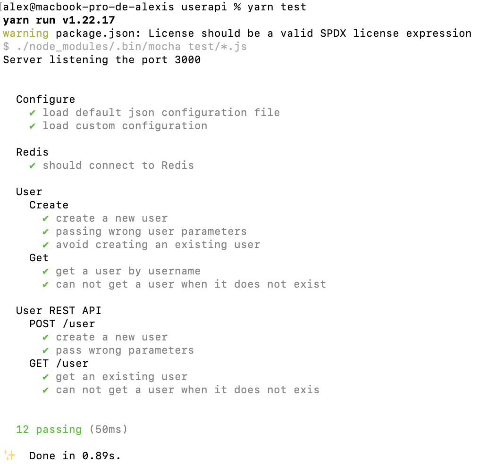

* You can run the application like this :
```
yarn start
```
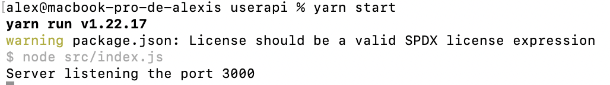

The server is now listening on the port 3000.
If you go on *localhost:3000*, you will see "Hello World!" as configured in the *src/index.js* file.


## 2. Apply CI/CD pipeline

The Continuous Integration (CI) will be done with Github Actions.
The .yml file is in `.github/workflows` folder.
Go to GitHub -> Actions page and check if the test are done.

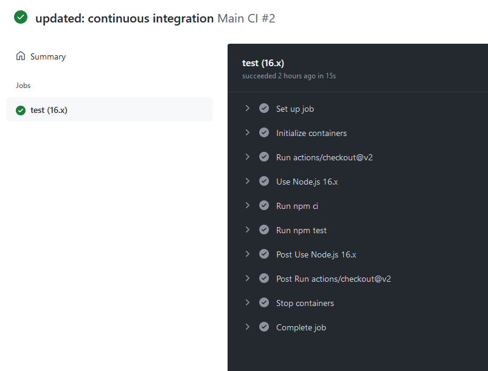

Continuous Delivery (CD) was done thanks to Heroku.
You can click on `alexis-app-cicd` to see my active deployment on Heroku. <br/> Or by clicking on this link : https://alexis-app-cicd.herokuapp.com/

Here :<br/>
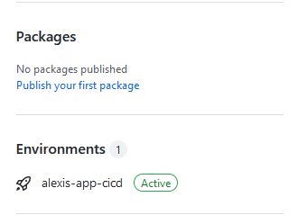

You should see this my app ('Hello world!' for now, maybe something else later):

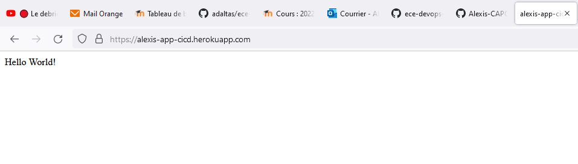

This is a tutorial to explain you what I did : <br/>
## **You must not do it ! It's just for explication !!**


1. You need to create your own account on [Heroku](https://heroku.com).

2. Create your app in Heroku and do basic configuration.

3. Now go to your Heroku account and go to Account Settings. Scroll to the bottom until you see API Key. Copy this key and go to your project's repository on GitHub.

In your Repo, go to Settings -> Secrets and click on "New Secret". Then enter HEROKU_API_KEY as the name and paste the copied API Key as the value.

You can now push your project to GitHub and it will be automatically deployed to Heroku henceforth.


4. Now, we will choose github as deployment method : <br/>
Inside the Deploy tab, scroll to Deployment method and connect your Github account. Find the repo and hit connect. Heroku should be authorized as an Oauth app in your github now.

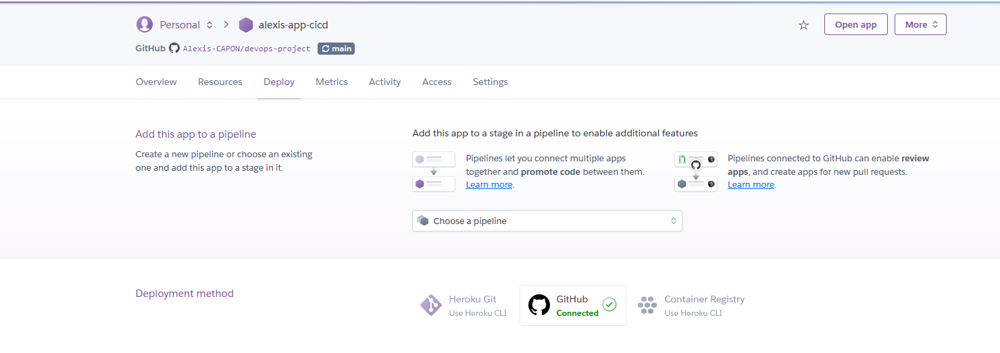
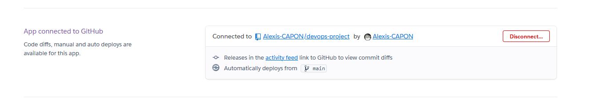

5. Go to Settings, in Config Vars category, "Reveal Config Vars" :<br/>
Add a new one, in the KEY part, put : `PROJECT_PATH` and in value, put : `userapi` (the subfolder in what contain your code).

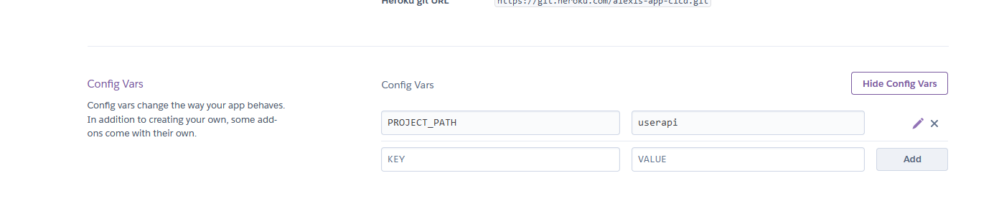

6. Next, you will need to provide a buildpack, so click on the button add buildpack and select `heroku/nodejs`.
Add another buildpack but this time, you this url : `https://github.com/timanovsky/subdir-heroku-buildpack.git`. <br/>
Once your done, make sure that the url pack one is as the top of the list !!

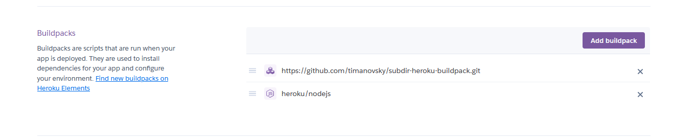

7. Last step, go back to deploy and enable autodeploy, and mark the case : "Wait for CI to pass before deploy" ! We have created a CI with github action so we can use this.

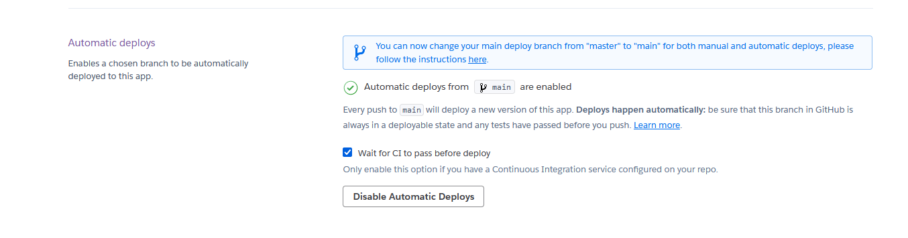

Once you have do all this step, you're done ! Congrats, you can deploy easly your application ! Always in Deploy, click on Deploy a GitHub branch with the main.

Go to https://alexis-app-cicd.herokuapp.com/ to see my app, but you can go to https://*your-name-app*.herokuapp.com/ to see yours.


Let's move on to next features.


## 3. IaC approach

-> Installation

1. You need to install a virtual machine, for example you can take VirtualBox : https://www.virtualbox.org/wiki/Downloads
2. Install Vagrant on your computer : https://www.vagrantup.com/downloads.html
3. Next, we will use centos as a linux distribution, to do this, run : <br/>
```vagrant box add centos/7```

4. Next, choose your provider, I personnaly used parallels, it's for Mac Only.

-> Uses

Now go to iac/part-1 :
``` cd iac/part-1``` <br/>

Next, run the command `vagrant up` to start it.

Ensure that all this working by typing `vagrant status`.

Your VM is created and up. <br/>

You can test it with the little provisioning script we provided, run :
```vagrant provision```

So now, go to iac/part-2 directory : <br/>
``` cd iac/part-2``` <br/>


Start the VM with :
```vagrant up```


You should go to 20.20.20.2


## 4. Build Docker image

-> Installation

1. Install [Docker Desktop](https://www.docker.com/get-started) following the instructions depending on your OS.
2. Make sure your docker installation is working properly by running the following command in a terminal:
  ```
  docker run hello-world
  ```

-> Use

Next, build your image with this command :
```docker build -t devops .```

Then, run it 
```docker run -p 3000:3000 devops```

You can go on https://localhost:3000 and you will see "Hello Wolrd! Alexis here!"

As you can see on this screen :
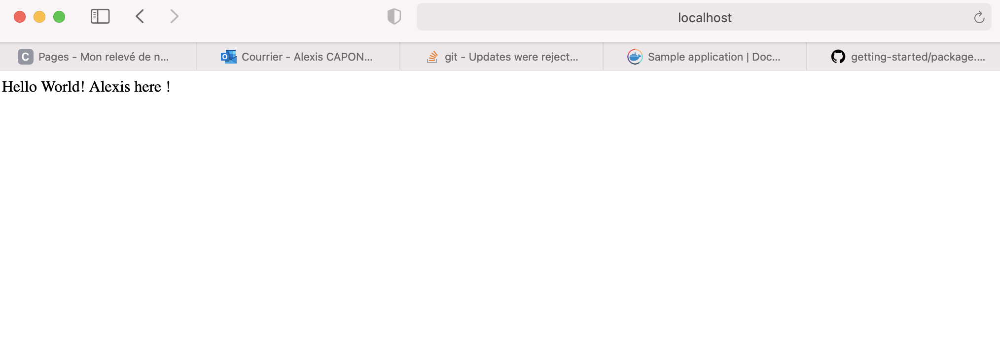


My docker image is on [Docker Hub](https://hub.docker.com/repository/docker/alexiscapon/devops-project).<br/>
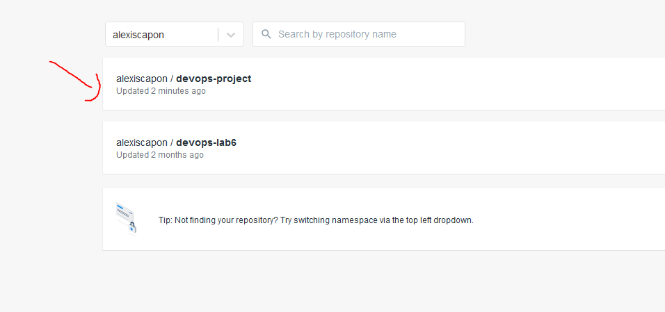
<br/>You can retrieve it from : <br/>

```docker pull alexiscapon/devops-project```

## 5. Make container orchestration using Docker Compose

-> Use

Run it with : <br/>
```docker-compose up```

Go check if it's work on https://localhost:3000

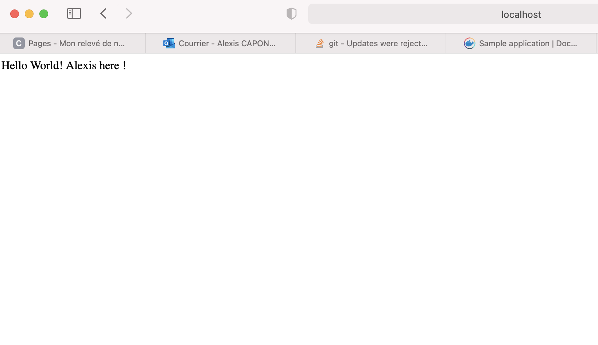

## 6. Make docker orchestration using Kubernetes

-> Installation

1. Install [Minikube](https://kubernetes.io/docs/tasks/tools/install-minikube/) following the instructions depending on your OS.

2. Start Minikube with:

```
minikube start
```

3. Verify that everything is OK with:

```
minikube status
```


-> Use

Run the pod configuration :
```kubectl apply -f k8s/full.yml```

List all the pods and find a name of a created pod

```kubectl get pods```

Enter to the container:

```kubectl exec -it <POD_NAME> bash```

Next, run ```curl localhost:3000```

It should appear a answer :

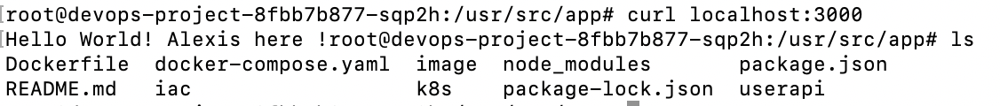

As you can see, you have also files of image inside.

Now, to verify if all is working, exit the VM and in your terminal, enter :
````minikube dashboard```


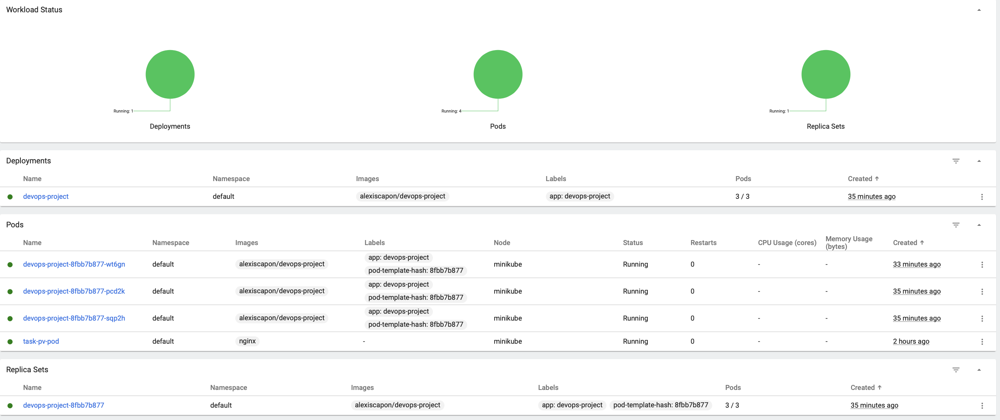


## 7. Make a service mesh using Istio

-> Installation

1. Install Minikube and start a Kubernetes cluster

After Minikube installation run:

- `minikube config set vm-driver virtualbox` (or `vmware`, or `kvm2`)

I didn't succeed to fully deploy Istio. I provided in the `istio` folder two files, app.yaml (to deploy differents version of the app and services, that's the part working) and a network.yaml (to open gateway, that's the part not working).<br/>
[app v2](https://hub.docker.com/repository/docker/alexiscapon/devops-project-v2)
<br/><br/>

## 8. Implement Monitoring

Since we have deployed Istio successfully, it's simple to deployed Prometheus and Grafana. As I done in the lab 10.
<br/><br/>

## Links

First of all, if something is not clear in installing or using something, be free to check : https://github.com/adaltas/ece-devops-2021-fall/tree/master/courses/devops/modules <br/>

And navigate in labs category of what you need !

Here are a list of my link you will need to follow this "tutorial" :

- https://alexis-app-cicd.herokuapp.com/
- https://hub.docker.com/repository/docker/alexiscapon/devops-project


<br/>

## Author

This project was made by Alexis CAPON and Cyril PEREZ.

- alexis.capon@edu.ece.fr
- cyril.perez@edu.ece.fr
<br/><br/>

## Additional info

Feel free to ask us questions by mail or directly on github !